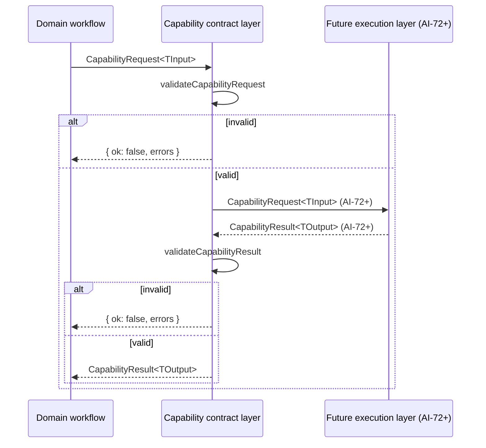

# AI Capability Contracts (AI-71)

Status: implemented. This document describes the executable seam that
AI-71 introduces between domain workflows and the future
model-execution, governance, evaluation, and routing layers (AI-72
through AI-78). It is the contract-side companion to
`docs/architecture/ai-system-architecture.md` and the catalog at
`config/ai-capabilities.json`.

## 1. Purpose

AI-70 established the architectural rule:

> Domain workflows depend on capability contracts and execution
> profiles, never directly on provider-specific SDKs or model names.

AI-71 turns that rule into executable, provider-neutral contracts:

- a stable `capability_id` vocabulary;
- a request envelope and a result envelope, both validated by JSON
  Schemas and by runtime validators;
- a policy declaration block that models privacy, budget, evaluation,
  and execution requirements without yet enforcing them;
- a typed definition registry that exposes the AI-70 catalog as a
  loadable, testable surface;
- a small set of explicit domain bindings that map the existing
  PCRAM capabilities to their current input/output JSON Schemas.

The contract layer is independent of:

- provider SDKs (`openai`, `anthropic`, `@google-cloud/vertexai`,
  `@alicloud/dashscope`, `@cloudflare/ai`);
- provider-specific response types;
- model names and provider names;
- transport protocols (HTTP, Workers AI, REST, gRPC);
- vendor metadata intended for approved exports.

## 2. Where the contracts live

| File | Role |
| --- | --- |
| `src/capabilities/contracts.ts` | Core types: `CapabilityId`, `CapabilityRequest`, `CapabilityResult`, `CapabilityContext`, `ResultGovernance`, `CapabilityDefinition`, `DownstreamPolicy`, `CapabilityPolicy`, plus enum guards. |
| `src/capabilities/policy.ts` | Declarative policy blocks: `HumanReviewPolicy`, `PrivacyRequirement`, `BudgetRequirement`, `EvaluationRequirement`, `ExecutionRequirement`. |
| `src/capabilities/error.ts` | Error model: `CapabilityError`, `CapabilityErrorCode`, `CapabilityErrorCategory`, and the canonical `FORBIDDEN_FIELD_NAMES` list. |
| `src/capabilities/validation.ts` | Runtime validators: `validateCapabilityRequest`, `validateCapabilityResult`, `validateCapabilityDefinition`, `validateCapabilityContext`, `validateGovernance`, `validatePolicy`, plus the deep walk that rejects provider/credential field names. |
| `src/capabilities/registry.ts` | Typed definition registry: `getCapabilityDefinition`, `listCapabilityDefinitions`, `assertCapabilitySupported`, `hasCapabilityDefinition`, `loadCapabilityRegistry`. |
| `src/capabilities/bindings.ts` | Explicit domain bindings: maps selected capabilities to their current input/output JSON Schemas. |
| `src/capabilities/version.ts` | `CAPABILITY_CONTRACT_VERSION`, `CAPABILITY_ID_PATTERN`, `SEMVER_PATTERN`, `SUPPORTED_CAPABILITY_CONTRACT_MAJORS`. |
| `src/capabilities/index.ts` | The supported public surface. Domain code should import from this module only. |
| `schemas/capability-request.schema.json` | JSON Schema for the request envelope. |
| `schemas/capability-result.schema.json` | JSON Schema for the result envelope. |
| `schemas/capability-error.schema.json` | JSON Schema for the error block. |
| `schemas/capability-policy.schema.json` | JSON Schema for the policy block. |
| `tests/capabilities/*.test.ts` | The contract compatibility tests. |
| `schemas/schema-registry.json` | Registers 24 contracts, including the four core capability schemas and the three corrected domain-binding schemas. |
| `config/ai-capabilities.json` | Source of truth for the catalog; the registry reads this file. |

## 3. Request lifecycle

In AI-71 the capability layer is definition-only. There is no
`Future` step yet; the runtime is owned by AI-72 through AI-78. The
contract layer is what domain code holds, and what future
implementations must respect.

## 4. Result lifecycle

The result envelope is the single source of truth for what a
capability produced. The contract treats the result as a closed
state machine with three terminal states:

- `succeeded` — the capability produced a typed `output`. The
  `governance` block describes the human-review and downstream
  posture. The contract does NOT interpret the governance block;
  downstream code reads it and decides what to do.
- `failed` — the capability did not produce an output. A structured
  `error` is present; the error category is `execution` or
  `internal`. `governance.downstream_allowed` is `false`.
- `blocked` — the capability was correctly requested but a declared
  policy forbids the call. A structured `error` is present; the
  error category is `policy` or `contract`.
  `governance.downstream_allowed` is `false`.

A `succeeded` result does NOT imply downstream approval. The review
act is a separate capability (`review.human.gate`) and the approval
state is expressed in `governance.approval_state`. A draft
extraction result is `approval_state: pending` and
`downstream_allowed: false` even when `status: succeeded`.

## 5. Failure behavior

The contract fails closed. The following inputs fail closed:

- unknown `capability_id` (typed `UnknownCapabilityError`);
- malformed `capability_id` (does not match the dotted pattern);
- unsupported schema MAJOR (the schema_version is not in
  `SUPPORTED_CAPABILITY_CONTRACT_MAJORS`);
- missing or empty `request_id` / `capability_id` / `schema_version` /
  `input`;
- `status: succeeded` without `output`;
- `status: succeeded` with an `error` block;
- `status: failed` or `blocked` without an `error` block;
- `status: blocked` with `governance.downstream_allowed: true`;
- `governance.downstream_allowed: true` with
  `governance.human_review_required: true` (this would be an
  automatic approval and is forbidden);
- `governance.approval_state: pending` with
  `human_review_required: false`;
- `governance.approval_state: rejected` with
  `downstream_allowed: true`;
- any field name that matches a forbidden provider/credential name
  (case-insensitive, deep-walked).

The contract never silently defaults to:

- a provider;
- a model;
- a profile;
- downstream approval;
- `human_review: false` on a regulated capability;
- unrestricted privacy;
- unlimited budget.

## 6. Policy declaration model

`CapabilityPolicy` is the single place where AI-71 declares the
requirements that AI-72 through AI-78 will eventually enforce. The
declaration is explicit: every block is required (even if its
values are empty) because the absence of a requirement is itself a
statement, not a default.

| Block | Declared by AI-71 | Enforced by |
| --- | --- | --- |
| `human_review_policy` | whether the capability itself requires human judgment; whether the result must carry an approval state | existing `human-review-gate`; catalog test in `tests/architecture/ai-capabilities.test.ts` |
| `downstream_policy` | whether the capability may produce a downstream-eligible result, and under what condition | existing `export-contract`; catalog test |
| `privacy_requirement` | privacy tier, ZDR requirement, redaction list, retention class | **AI-73** |
| `budget_requirement` | per-request/per-session/per-day cap and the window | **AI-74** |
| `evaluation_requirement` | metric set, gold-case requirement, minimum quality | **AI-75/77** |
| `execution_requirement` | whether a provider is required, optional, or none; whether a deterministic fallback is acceptable | **AI-78** |

The default `CapabilityPolicy` is derived from the AI-70 catalog
row. The derivation rules are:

- `human_review_policy.required` mirrors `human_review`;
- `human_review_policy.no_auto_approval` is `true` iff
  `human_review: true`;
- `downstream_policy.downstream_allowed` mirrors the catalog;
- `privacy_requirement.tier` is `regulated` for `risk_tier: high`,
  `sensitive` for `medium`, `standard` for `low`;
- `privacy_requirement.zdr_required` is `true` for `risk_tier: high`;
- `privacy_requirement.redact_fields` is the high/medium field list
  from the catalog;
- `evaluation_requirement.gold_case_required` is `true` for
  capabilities that are both `human_review: true` and
  `risk_tier: high`.

The derivation is deterministic and is verified by
`tests/capabilities/registry.test.ts`.

## 7. Provider neutrality

The contract never carries:

- `provider`, `provider_id`, `provider_name`, `provider_response`;
- `model`, `model_id`, `model_name`, `model_version`;
- `api_key`, `apikey`, `api_token`, `token`, `bearer`, `authorization`;
- `secret`, `client_secret`, `access_key`, `private_key`, `password`;
- `endpoint_url`, `base_url`;
- `profile`, `profile_id`, `execution_profile`;
- `prompt_hash`;
- `reviewer`, `reviewer_id`, `reviewer_name`.

The list lives in `FORBIDDEN_FIELD_NAMES` (see `src/capabilities/error.ts`).
The runtime validator walks the request, the result, and the
definition and rejects any field whose name is in the list, even
when the field is nested. The JSON Schemas also reject a small
canonical subset at the top level via `allOf.not.anyOf.required`.

Provider selection is a routing concern (AI-78). Domain code never
names a provider, a model, or a profile. The capability_id is a
description of the work; the routing layer resolves the execution
profile.

## 8. Domain bindings

The binding layer is a small, explicit, auditable list of mappings
between selected existing capabilities and the JSON Schemas they
already speak. The list lives in `src/capabilities/bindings.ts`
under `DOMAIN_CAPABILITY_BINDINGS`. The minimum required set,
per the AI-71 spec, is:

| Capability | Input schema | Output schema | Risk | Review | Downstream | Provider |
| --- | --- | --- | --- | --- | --- | --- |
| `evidence.extraction.normative_claims` | `extractable-evidence-packet.schema.json` | `ai-extraction-result.schema.json` | high | yes | no | required |
| `evidence.classifier_candidate.generate` | `ai-extraction-result.schema.json` | `classifier-intelligence-artifact.schema.json` | high | yes | no | none |
| `source.regulatory_advisory.readiness_check` | `regulatory-advisory-readiness-request.schema.json` | `regulatory-advisory-readiness-result.schema.json` | medium | yes | no | none |
| `review.human.gate` | `classifier-intelligence-artifact.schema.json` | `classifier-intelligence-artifact.schema.json` | high | no | conditional | none |
| `artifact.approved.generate` | `classifier-intelligence-artifact.schema.json` | `classifier-intelligence-artifact.schema.json` | high | yes | conditional | none |
| `artifact.export_contract.generate` | `classifier-intelligence-artifact.schema.json` | `classifier-approved-artifact-export.schema.json` | high | yes | yes | none |
| `artifact.approved.serve_http` | `approved-artifact-read-request.schema.json` | `classifier-approved-artifact-export.schema.json` | medium | no | yes | none |

The advisory readiness binding mirrors the current
`RegulatoryAdvisoryReadinessBuildInput` and
`RegulatoryAdvisoryReadinessView` structures. Its result exposes
source coverage and missing or unreviewed evidence, requires human
review, fixes `downstream_allowed` to `false`, and never represents a
final regulatory conclusion or carries provider/reviewer metadata.

The approved-artifact HTTP binding accepts only the current domain
lookup identifiers (`source_id` and `artifact_id`) using the same
patterns as `src/server/api-server.ts`. API keys, headers, endpoints,
IP addresses, reviewer data, and export payload fields are outside the
contract. Its output remains the existing approved read-only export.

`artifact.export_contract.generate` is a post-review transformation:
its input must already satisfy the reviewed-approved precondition. It
strips internal governance and reviewer metadata and emits an approved
read-only export, never an unreviewed model output.

## 8.1 Schema and fixture inventory

The repository now contains 32 JSON Schema files and 166 PCRAM snapshot
fixtures. The schema registry contains 24 contract entries. For the
three corrected domain contracts, the registry records three valid
fixtures and 13 invalid fixtures covering missing fields, identifier
safety/path traversal, forbidden provider/reviewer/transport fields,
incorrect downstream approval, and malformed source-coverage or
missing-evidence structures.

The binding is descriptive, not invasive. The existing domain
modules under `src/agents/`, `src/advisory/`, and `src/server/` are
NOT modified by AI-71. The contract layer is layered on top.

## 9. Versioning

| Field | Rule |
| --- | --- |
| `CAPABILITY_CONTRACT_MAJOR` | The contract surface version. Removing or changing a required field, tightening a previously optional field, or changing the meaning of an existing field requires a MAJOR bump. |
| `CAPABILITY_CONTRACT_MINOR` | Strictly additive optional fields. |
| `CAPABILITY_CONTRACT_PATCH` | Documentation, formatting, or internal refactors that do not change the wire shape. |

Unknown MAJOR versions fail closed. The current supported MAJOR is
`1`. The runtime validator in `validation.ts` enforces the rule on
top of the JSON Schema.

`approved exports keep their existing independent versioning`. The
classifier-approved-artifact-export schema and the
classifier-intelligence-artifact schema are not renamed or versioned
by AI-71.

## 10. Migration path for existing agents

The existing agents under `src/agents/` continue to work unchanged.
The contract layer is additive. The migration path is:

1. **Now (AI-71).** Domain code MAY import the contract types from
   `src/capabilities/index.ts`. The registry exposes the AI-70
   catalog as a typed surface. The bindings list documents the
   existing schema surface for the seven selected capabilities.
2. **AI-72 (multi-provider gateway).** Provider adapters import
   only the contract types. The gateway facade accepts a
   `CapabilityRequest` and returns a `CapabilityResult`. Domain
   code is unchanged.
3. **AI-73 (privacy/ZDR).** The privacy requirement is read from
   the capability definition and enforced at the adapter boundary.
   The contract is unchanged.
4. **AI-74 (budget governor).** The budget requirement is read
   from the capability definition and enforced before paid
   execution.
5. **AI-75/77 (evaluation/benchmark).** The evaluation requirement
   is read from the capability definition. No domain code change.
6. **AI-78 (best-profile router).** The router consumes
   `CapabilityDefinition` plus evaluation records. No domain code
   change.

The contract is the seam. Domain code never imports a provider SDK;
it never names a model; it never names a profile.

## 11. Responsibilities deferred to AI-72 through AI-78

| Concern | Owner |
| --- | --- |
| Provider SDK calls (DeepSeek, DashScope, OpenAI, Anthropic, Google, Cloudflare Workers AI) | **AI-72** |
| Multi-provider execution, retries, normalization | **AI-72** |
| Privacy, ZDR enforcement, retention | **AI-73** |
| Token counting, cost metering, budget blocking | **AI-74** |
| Evaluator contracts, scoring | **AI-75** |
| Gold case fixtures | **AI-76** |
| Benchmark execution | **AI-77** |
| Best-profile router, lifecycle states, shadow traffic | **AI-78** |
| Profile promotion | **AI-77 + AI-78** |
| Audit record writing | **AI-73 + AI-78** |

AI-71 deliberately does not implement any of these. The contract
layer is a contract; the gateway, governance, evaluation, and
routing layers are downstream of it.

## 12. Safety invariants

AI-71 preserves all AI-70 invariants and adds the following:

1. Unreviewed model output is not approved intelligence.
2. Model performance scores cannot override missing evidence.
3. Cost optimization cannot override privacy policy.
4. Routing cannot override human-review requirements.
5. Vendor metadata must not leak through approved external exports.
6. `vlatam-global` must not need provider credentials.
7. Domain workflows must remain portable across providers.
8. Unsupported or unknown configurations must fail closed.
9. Regulatory conclusions require evidence provenance and
   appropriate review.
10. Shadow outputs must never influence production responses.
11. **Capability contracts must not imply provider eligibility.**
    The contract surface is provider-neutral; the registry is
    definition-only.
12. **Capability success must not imply downstream approval.** The
    `governance` block is the only place downstream eligibility is
    expressed. `succeeded` results do NOT auto-approve.
13. **Policy declarations must be explicit rather than inferred.**
    `CapabilityPolicy` is required in every `CapabilityDefinition`,
    and every sub-block is required (even if its values are
    empty).
14. **Raw provider errors must not become domain artifacts.** The
    `CapabilityError` shape is a small closed-code enumeration;
    the contract never surfaces raw provider exception messages,
    stack traces, or vendor error codes.

## 13. Non-goals

AI-71 does not implement:

- provider adapters or provider SDK calls;
- multi-provider execution, retries, or fallback;
- ZDR enforcement, privacy redaction, or retention controls;
- token counting or cost metering;
- budget blocking;
- evaluator execution or gold case datasets;
- benchmark runners;
- profile scoring or lifecycle promotion;
- shadow traffic;
- best-profile routing;
- production deployment;
- Supabase or database migrations;
- changes to `vlatam-global`;
- a generic `executeCapability()` runtime that pretends to
  execute providers.

A validation or dispatch interface is acceptable, but its
implementation must fail closed or use existing deterministic
local implementations only.
