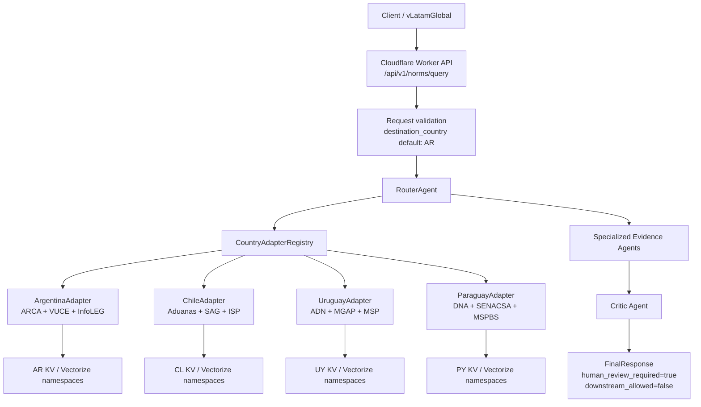

# Multi-Country Architecture Design

## 1. Executive Summary

This document designs the next architecture step for expanding `vlatam-ai-lab` from Argentina-only regulatory intelligence to a multi-country model covering Argentina (AR), Chile (CL), Uruguay (UY), and Paraguay (PY), with room to add Brazil, Bolivia, and other Latin American markets later.

Source snapshot context:

- Current branch for this design: `feat/multi-country-architecture`.
- Current local architecture: Cloudflare Worker API, Hono router, specialized agents, Cloudflare KV, Cloudflare Vectorize, and Workers AI embeddings.
- Existing Argentina flow: `/api/v1/norms/query` defaults `destination_country` to `AR`, routes through `RouterAgent`, and uses ARCA, VUCE, and InfoLEG evidence sources.
- Existing embedding model: `@cf/baai/bge-m3`, multilingual, 1024 dimensions.
- Existing AR Vectorize bindings: `ARCA_EMBEDDINGS`, `INFOLEG_EMBEDDINGS`, `VUCE_EMBEDDINGS`.

Design goals:

- Keep Argentina behavior backward compatible.
- Add country-specific logic behind a `CountryAdapter` contract.
- Isolate regulatory data by country and source.
- Preserve Cloudflare-first deployment and low operating cost.
- Keep all generated outputs review-gated with `human_review_required=true` and `downstream_allowed=false`.

Assumptions and limitations:

- No external source validation was performed for this design. URLs and duty/VAT assumptions are based on the task brief and must be reviewed before implementation.
- This is design-only. No implementation files, migrations, deployments, or external service calls are authorized by this document.
- Existing AR KV namespaces and Vectorize indexes remain untouched unless a future approved migration explicitly changes them.

## 2. Architecture Overview

The architecture introduces a country selection layer in front of evidence retrieval. The Router Agent remains the orchestration point, but it delegates country-specific tariff, intervention, legal norm, and cost logic to an adapter selected from `destination_country`.



Recommended high-level components:

- `CountryAdapter`: country contract for tariffs, interventions, legal norms, and cost calculations.
- `CountryAdapterRegistry`: maps ISO country codes to adapter instances.
- `RouterAgent` country selection: uses `context.destination_country || 'AR'`.
- Country-specific crawlers: local scripts that generate reviewed source snapshots and embedding payloads.
- Country-specific Vectorize indexes: separate indexes by country and source.
- Shared Workers AI embedding service: keeps `@cf/baai/bge-m3` as the multilingual model for all countries.

## 3. Country Adapter Interface

The adapter interface should be introduced in a shared agent/domain module when implementation begins. It keeps country differences out of the Router and makes future country additions predictable.

```typescript
type CountryCode = 'AR' | 'CL' | 'UY' | 'PY';
type OperationType = 'import' | 'export';

interface TariffData {
  ncm: string;
  source: string;
  dutyRate: number;
  vatRate: number;
  statisticalRate?: number;
  preferentialRate?: number;
  effectiveDate?: string;
  evidenceRefs: string[];
}

interface Intervention {
  agency: string;
  interventionType: string;
  operation: OperationType;
  requirement: string;
  evidenceRefs: string[];
}

interface LegalNorm {
  normId: string;
  title: string;
  source: string;
  summary: string;
  effectiveDate?: string;
  evidenceRefs: string[];
}

interface CostBreakdown {
  fobValue: number;
  dutyAmount: number;
  vatAmount: number;
  statisticalAmount?: number;
  otherFees?: Array<{ label: string; amount: number }>;
  totalEstimatedCost: number;
  currency: string;
  assumptions: string[];
}

interface CountryAdapter {
  countryCode: 'AR' | 'CL' | 'UY' | 'PY';
  countryName: string;
  currency: string;
  language: string;

  getTariffData(ncm: string): Promise<TariffData>;
  getInterventions(ncm: string, operation: 'import' | 'export'): Promise<Intervention[]>;
  getLegalNorms(ncm: string): Promise<LegalNorm[]>;
  calculateCosts(fobValue: number, tariffData: TariffData): Promise<CostBreakdown>;
}
```

Router selection behavior:

```typescript
const destinationCountry = context.destination_country || 'AR';
const adapter = countryAdapterRegistry.get(destinationCountry);

if (!adapter) {
  return unsupportedCountryResponse(destinationCountry);
}

const [tariffData, interventions, legalNorms] = await Promise.all([
  adapter.getTariffData(context.candidate_ncm8),
  adapter.getInterventions(context.candidate_ncm8, 'import'),
  adapter.getLegalNorms(context.candidate_ncm8),
]);
```

The registry should fail closed for unsupported countries and return a review-required response rather than falling back silently to Argentina.

## 4. Data Isolation Strategy

Recommended strategy: Option A, separate namespaces and Vectorize indexes per country and source.

This avoids cross-country retrieval contamination, keeps regulatory provenance clean, and lets each country evolve independently as source formats change.

| Country | Tariff index | Intervention index | Normative index |
| --- | --- | --- | --- |
| AR | `ar-arca-embeddings` | `ar-vuce-embeddings` | `ar-infoleg-embeddings` |
| CL | `cl-aranceles-embeddings` | `cl-intervenciones-embeddings` | `cl-normativa-embeddings` |
| UY | `uy-aranceles-embeddings` | `uy-intervenciones-embeddings` | `uy-normativa-embeddings` |
| PY | `py-aranceles-embeddings` | `py-intervenciones-embeddings` | `py-normativa-embeddings` |

Cloudflare binding design:

- Keep existing AR bindings for backward compatibility during migration.
- Add country-prefixed bindings only when implementation starts, for example `CL_ARANCELES_EMBEDDINGS`, `UY_NORMATIVA_EMBEDDINGS`, and `PY_INTERVENCIONES_EMBEDDINGS`.
- Use metadata filters inside each index for source version, snapshot ID, NCM, operation, agency, effective date, and review status.
- Store raw and parsed country data under country-specific local folders before upload, for example `data/sources/cl`, `data/parsed/uy`, and `snapshots/pcram/py-*`.

KV isolation:

- Preferred key format: `{country}:{source}:{entity}:{id}`.
- Examples: `cl:aduanas:chapter:42`, `uy:adn:ncm:42029200`, `py:senacsa:intervention:0102`.
- Cache source fetch results with 30-day TTL for crawler/runtime cache layers where legally and operationally appropriate.

## 5. Country-Specific Details

### Chile (CL)

Summary:

- Country name: Chile.
- Currency: `CLP`.
- Language: Spanish.
- Tariff source: Aduanas Chile, `https://www.aduana.cl/`.
- General import tariff assumption: 6%.
- VAT assumption: 19%.
- Main intervention sources: SAG for agricultural goods, ISP for health-related goods, Aduanas for customs controls.
- Difficulty: Medium.

Adapter responsibilities:

- Normalize NCM/HS input to Chile tariff nomenclature.
- Retrieve tariff evidence from Aduanas Chile snapshots.
- Identify SAG/ISP/Aduanas interventions from country-specific intervention indexes.
- Calculate estimated import costs with duty and VAT separated.

Primary implementation concern:

- Chile can use relatively stable ad valorem assumptions for initial MVP, but must still preserve source-specific evidence references for any product-level exceptions.

### Uruguay (UY)

Summary:

- Country name: Uruguay.
- Currency: `UYU`.
- Language: Spanish.
- Tariff source: ADN Uruguay, `https://www.aduanas.gub.uy/`.
- Tariff regime: AEC MERCOSUR.
- VAT assumption: 22%.
- Main intervention sources: MGAP for agricultural goods, MSP for health-related goods, ADN for customs controls.
- Difficulty: Medium.

Adapter responsibilities:

- Reuse MERCOSUR NCM/AEC concepts where applicable while keeping Uruguay evidence isolated.
- Retrieve ADN tariff evidence by NCM.
- Identify MGAP/MSP/ADN interventions.
- Calculate import cost estimates with AEC and VAT treatment documented in assumptions.

Primary implementation concern:

- Avoid assuming Argentina NCM suffixes or ARCA data structures apply to Uruguay. Shared MERCOSUR concepts can inform validation, but retrieved evidence must remain Uruguay-specific.

### Paraguay (PY)

Summary:

- Country name: Paraguay.
- Currency: `PYG`.
- Language: Spanish.
- Tariff source: DNA Paraguay, `https://www.aduana.gov.py/`.
- Tariff regime: AEC MERCOSUR.
- VAT assumption: 10%.
- Main intervention sources: SENACSA for agricultural and animal health controls, MSPBS for health-related goods, DNA for customs controls.
- Special regimes: Maquila.
- Difficulty: High.

Adapter responsibilities:

- Retrieve DNA tariff evidence by NCM.
- Identify SENACSA/MSPBS/DNA interventions.
- Represent Maquila as a special-regime dimension, not as a default tariff assumption.
- Surface additional warnings when product eligibility depends on manual regime review.

Primary implementation concern:

- Paraguay is expected to need more manual source normalization and review. The adapter should make uncertainty explicit and require stronger human review gates before any downstream use.

## 6. Embedding Strategy

Embedding model:

- Use Cloudflare Workers AI model `@cf/baai/bge-m3`.
- Multilingual Spanish support covers Argentina, Chile, Uruguay, and Paraguay variants.
- Dimensionality: 1024.
- Expected generation cost: free under Cloudflare Workers AI usage assumptions in the current setup.

Generation scripts to add in implementation phases:

- `scripts/generate-cl-embeddings.ts`
- `scripts/generate-uy-embeddings.ts`
- `scripts/generate-py-embeddings.ts`

Recommended embedding payload shape:

```json
{
  "id": "cl:aduanas:tariff:42029200:2026-06",
  "text": "Country-specific source text to embed",
  "metadata": {
    "country": "CL",
    "source": "aduanas",
    "source_type": "tariff",
    "ncm": "42029200",
    "operation": "import",
    "effective_date": "2026-06-01",
    "snapshot_id": "reviewed-source-snapshot-id",
    "review_status": "reviewed"
  }
}
```

Retrieval rules:

- Query only the indexes for the selected `destination_country`.
- Query source-specific indexes in parallel.
- Apply metadata filters for `country`, `source_type`, and reviewed status.
- Keep exact KV lookup as the fast path when a country-specific key exists.
- Use Vectorize as fallback for semantic retrieval and related evidence.

## 7. Implementation Phases

### Phase 1: Chile, 2-3 weeks

Week 1:

- Build local crawlers/snapshot capture for Aduanas Chile tariff data.
- Build intervention capture for SAG, ISP, and Aduanas evidence.
- Produce reviewed local source snapshots and parser limitations.

Week 2:

- Implement `ChileAdapter`.
- Add CL Vectorize indexes and Workers bindings behind explicit configuration review.
- Add unit tests for tariff retrieval, intervention retrieval, norm retrieval, and cost calculation.

Week 3:

- Run local integration tests against reviewed CL fixtures.
- Deploy only after human approval.
- Run production smoke tests with review-required output gates.

### Phase 2: Uruguay, 2-3 weeks

Week 1:

- Build local crawlers/snapshot capture for ADN Uruguay tariff data.
- Capture MGAP, MSP, and ADN intervention references.
- Normalize AEC MERCOSUR evidence without reusing Argentina-specific data.

Week 2:

- Implement `UruguayAdapter`.
- Add UY Vectorize indexes and bindings.
- Add adapter unit tests and retrieval integration tests.

Week 3:

- Run local E2E tests for `destination_country: "UY"`.
- Deploy after human approval.
- Validate regression tests for Argentina.

### Phase 3: Paraguay, 3-4 weeks

Week 1-2:

- Build DNA Paraguay tariff source snapshots.
- Capture SENACSA, MSPBS, DNA, and Maquila-related source references.
- Document manual normalization gaps and source reliability limitations.

Week 3:

- Implement `ParaguayAdapter`.
- Add PY Vectorize indexes and bindings.
- Add unit tests with explicit uncertainty and Maquila handling.

Week 4:

- Run local E2E tests for `destination_country: "PY"`.
- Deploy after human approval.
- Add enhanced manual review checklist for high-difficulty Paraguay flows.

## 8. Cost Analysis

Current Argentina-only estimate:

- Approximate monthly cost: USD 10-15.
- Main cost drivers: Cloudflare Vectorize indexes, Worker usage, KV reads/writes, and LLM calls.

Four-country estimate:

- Approximate monthly cost: USD 40-60.
- Primary multiplier: country/source Vectorize index count.
- Embeddings remain minimal-cost because generation uses Cloudflare Workers AI `@cf/baai/bge-m3`.

Cost controls:

- Keep one Vectorize index per country/source rather than per agency subsource.
- Store exact-match structured tariff data in KV and reserve Vectorize for fallback retrieval.
- Cache crawler fetches for 30 days.
- Batch embedding generation and regenerate only changed source snapshots.
- Keep unsupported or low-confidence responses short and review-gated to avoid unnecessary downstream calls.

## 9. Risk Assessment

| Risk | Impact | Mitigation |
| --- | --- | --- |
| Source site structure changes | Crawlers break or parse stale data | Modular source-specific crawlers, source snapshot manifests, parser tests |
| Rate limiting | Incomplete source capture | 30-day cache layer, polite crawler pacing, manual snapshot fallback |
| Different NCM interpretations | Wrong tariff/intervention selection | Country-specific validation and no silent AR fallback |
| Country-specific legal exceptions | Misleading generic cost estimate | Adapter assumptions, warnings, and mandatory human review |
| Cross-country retrieval contamination | Incorrect evidence returned | Separate Vectorize indexes and metadata filters |
| Paraguay source complexity | Higher manual effort and uncertainty | Longer phase, explicit limitations, stronger review checklist |
| Cloudflare binding sprawl | Operational configuration errors | Naming conventions, per-country config checklist, local tests before deploy |
| Cost growth | Higher monthly spend as countries expand | KV exact-match fast path, changed-snapshot embedding regeneration, usage monitoring |

## 10. Testing Strategy

Unit tests:

- One test suite per adapter.
- Validate `getTariffData`, `getInterventions`, `getLegalNorms`, and `calculateCosts`.
- Include country-specific NCM normalization cases.
- Include no-data, partial-data, and unsupported-operation cases.

Integration tests:

- Use reviewed local fixtures only.
- Validate KV exact-match retrieval.
- Validate Vectorize fallback retrieval with mocked or local test bindings.
- Validate source metadata and evidence references are preserved.

E2E API tests:

- `destination_country` omitted returns Argentina behavior.
- `destination_country: "AR"` returns existing Argentina path.
- `destination_country: "CL"` routes only to Chile indexes and adapter.
- `destination_country: "UY"` routes only to Uruguay indexes and adapter.
- `destination_country: "PY"` routes only to Paraguay indexes and adapter.
- Unsupported country codes return a review-required unsupported-country response.

Regression tests:

- Existing Argentina fixtures continue to pass unchanged.
- Existing AR KV keys and AR Vectorize bindings remain valid.
- Existing response shape remains compatible with `FinalResponse`.
- Existing governance flags remain fixed: `human_review_required=true`, `downstream_allowed=false`.

## 11. Migration Plan

Step 1: Design approval.

- Review this document with technical and domain stakeholders.
- Confirm country assumptions, source URLs, tariff/VAT defaults, and intervention agencies.
- Confirm Cloudflare cost envelope before creating new indexes.

Step 2: Adapter contract implementation.

- Add `CountryAdapter` and `CountryAdapterRegistry`.
- Implement `ArgentinaAdapter` as a compatibility wrapper around current ARCA/VUCE/InfoLEG retrieval.
- Keep current endpoint, request shape, and default `destination_country: "AR"`.

Step 3: Router integration.

- Update `RouterAgent` to select adapters by `destination_country`.
- Keep old Argentina path available until tests prove adapter parity.
- Return fail-closed review-required responses for unsupported countries.

Step 4: Country rollout.

- Add Chile first, then Uruguay, then Paraguay.
- Add one country only after source snapshots, parser evidence, adapter tests, and E2E tests pass.
- Require human approval before any network access, dependency installation, Cloudflare index creation, KV upload, deployment, commit, or push.

Step 5: Future scalability.

- Add new countries by implementing the same adapter contract.
- Keep country/source indexes isolated.
- Extend `CountryCode` only after source acquisition, schemas, tests, and review are complete.
- Candidate future countries: Brazil and Bolivia.

Backward compatibility guarantee:

- Requests without `destination_country` continue to behave as Argentina requests.
- Existing Argentina endpoint path remains unchanged.
- Existing Argentina KV namespaces and Vectorize indexes remain untouched.
- New countries are opt-in through `destination_country`.

## 12. Appendix: Data Source URLs

Argentina existing sources:

- ARCA: existing local ARCA source snapshots and `ARCA_EMBEDDINGS`.
- InfoLEG: existing local InfoLEG source snapshots and `INFOLEG_EMBEDDINGS`.
- VUCE: existing local VUCE source snapshots and `VUCE_EMBEDDINGS`.

Chile:

- Aduanas Chile: `https://www.aduana.cl/`
- SAG: to be confirmed during source onboarding.
- ISP: to be confirmed during source onboarding.

Uruguay:

- ADN Uruguay: `https://www.aduanas.gub.uy/`
- MGAP: to be confirmed during source onboarding.
- MSP: to be confirmed during source onboarding.

Paraguay:

- DNA Paraguay: `https://www.aduana.gov.py/`
- SENACSA: to be confirmed during source onboarding.
- MSPBS: to be confirmed during source onboarding.
- Maquila regime references: to be confirmed during source onboarding.
